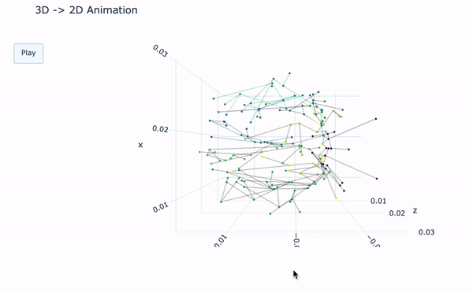

# ArterialVis<!-- omit in toc -->

*Public-facing repository of work-in-progress library for image processing, segmentation, 3D to 2D network abstraction of cerebrovasculature, and interactive visualization of planar graph embedding for detection of neurological anomalies*


There are two ends to this project which have yet to be connected: the first, to segment neuroimaging data and extract morphology; the second, to provide interactive animations for 2D graph embedding of the extracted 3D morphology. We include both halves of this workflow for documentary purposes, but the first half (segmentation) remains incomplete, while the pilot of the project and the focus of this repository uses pre-existing morphologized data for 2D embedding and interactive demonstration.

Please note that at any time, you can access module and function descriptions by accessing the docstring using the Python command `print(<MODULE OR FUNCTION>.__doc__)` inside the Jupyter Notebook.

## Table of Contents<!-- omit in toc -->
* [Getting Started](#getting-started)
  * [Option 1: Setting up a virtual environment with `conda`](#option-1-setting-up-a-virtual-environment-with-conda)
  * [Option 2: Setting up a virtual environment with `venv` and `pip`](#option-2-setting-up-a-virtual-environment-with-venv-and-pip)
* [Downloading & Processing the Sample Data](#downloading--processing-the-sample-data)
* [Using the Morphology & Graphing Module](#using-the-morphology--graphing-module)
  * [Running the Morphology Notebook](#running-the-morphology-notebook)
* [Using the Imaging & Segmentation Module](#using-the-imaging--segmentation-module)
  * [Running the Segmentation Notebook](#running-the-segmentation-notebook)
  * [Future Work](#future-work)
* [Data Ingestion Technical Details](#data-ingestion-technical-details)
  * [Neuromorphology](#neuromorphology)
  * [Neuroimaging](#neuroimaging)
  * [Custom data](#custom-data)

## Getting Started

We recommend using a virtual environment to keep packages organized. There are two recommended ways to do this from the command line; either using `conda` or `venv` and `pip`:

### Option 1: Setting up a virtual environment with `conda`

(if using Windows, ensure these commands are run in conda shell, not PowerShell)

Set up your virtual environment with:
`conda create --name arterialenv -f environment.yml python=3.8.3`

If you run into issues with the `environment.yml` file, you may need to use pip:
try just running `conda create --name arterialenv python=3.8.3` and then use pip to install requirements with `pip install -r requirements.txt`

**Note:** *There is a known issue with iPyVolume in Python 3.10; we are using Python 3.8.3 because it appears to be stable.*

Activate the environment with:
`conda activate arterialenv`

If you're having trouble viewing your virtual environments, run
- `conda info --envs` on Linux with conda
- `lsvirtualenv -l` on Windows

In order to view your virtual environment in Jupyter Notebooks:
`python -m ipykernel install --user --name arterialenv --display-name "ArterialVis environment"`

You can then run Jupyter Notebook from the Anaconda GUI.

### Option 2: Setting up a virtual environment with `venv` and `pip`

1. Run the setup commands below to create and activate a virtual environment to hold the specific versions of packages needed for this project.

   * On macOS or Linux, run these three commands *separately* in case there are errors:

       ```bash
       python3 -m venv env
       ```

       ```bash
       source env/bin/activate
       ```

       ```bash
       which python
       ```

   * On Windows, run these three commands *separately* in case there are errors:

       ```bash
       python -m venv env
       ```

       ```bash
       .\env\Scripts\activate.bat
       ```

       ```bash
       where.exe python
       ```

     Check the path(s) provided by `which python` or `where.exe python`—the first one listed *should* be inside the `env` directory you just created.

2. Then, install necessary packages. Note that you should install the exact versions of the packages.

    ```bash
    pip install -r requirements.txt
    ```

    This may take a few minutes.

3. To run Jupyter Notebook, execute this line on your command line / terminal inside the virtual environment and in the project directory:

    ```bash
    jupyter notebook
    ```

## Downloading & Processing the Sample Data

We use publicly available data to demonstrate the project that must be downloaded separately.

To download and process the data so it can be ingested by this project, run this command using the command line / terminal inside the virtual environment:

```bash
python download_sample_data.py
```

Here is how the data will be organized into directories:
|            | Data Source                                                    | Save Location                  | Data Documentation                              |
| ---------- | -------------------------------------------------------------- | ------------------------------ | ----------------------------------------------- |
| Imaging    | [Zenodo data](https://zenodo.org/record/16956/files/DICOM.zip) | [`dicom_files/`](dicom_files/) | [Zenodo docs](https://zenodo.org/record/16956)  |
| Morphology | [BraVa data](http://cng.gmu.edu/brava/files/swc_files.zip)     | [`swc_files/`](swc_files/)     | [BraVa docs](http://cng.gmu.edu/brava/home.php) |

If you are having trouble downloading sample data using this method, you can also manually download the data using the information saved in the file [`.env`](.env) and in the URLs above.

For the curious, the [Data Ingestion Technical Details](#data-ingestion-technical-details) section describes more about these datasets, how they are processed, and how you can load custom data.

## Using the Morphology & Graphing Module

The ArterialVis morphology and graphing module takes `*.swc` files as input, and outputs interactive interfaces for exploring 3D morphological structure and animation from 3D spatial positioning to 2D abstracted graph embedding using multiple layout algorithms.


This image shows an animation on network that has been sparsified for performance reasons.


We recommend testing all morphological embeddings on sparsified graphs before moving to animation of the complete graph; generating a network layout for the complete vascular tree can take an average of 15 minutes on an ordinary personal computer. Here is an example of the complete graph.


### Running the Morphology Notebook

If you used [Option 1: `conda`](#option-1-setting-up-a-virtual-environment-with-conda) to set up, run Jupyter Notebook from the Anaconda GUI.

If you used [Option 2: `venv` and `pip`](#option-2-setting-up-a-virtual-environment-with-venv-and-pip) to set up, run these commands from to activate your virtual environment in a new command prompt / terminal and start Jupyter Notebook.

* macOS/Linux:

    ```bash
    source env/bin/activate
    jupyter notebook
    ```

* Windows:

    ```bash
    .\env\Scripts\activate.bat
    jupyter notebook
    ```

Open [`morphology.ipynb`](morphology.ipynb) and step through each cell to view outputs.

## Using the Imaging & Segmentation Module

***Note: This portion of the library is incomplete.***

Functions exist for reading, clustering, masking, removing islands, and rendering volumes. Because masking and island removal alone are insufficient for acceptable segmentation, functions do not yet exist for centerline extraction and exporting of morphology. Please refer to the following section—[Using the Morphology & Graphing Module](#using-the-morphology--graphing-module)—for 2D embedding of morphological structures from pre-existing segmented and morphologized data.


### Running the Segmentation Notebook

Perform the same steps as for [running the morphology notebook](#running-the-morphology-notebook), just instead opening [`segmentation.ipynb`](segmentation.ipynb) and step through each cell to view outputs.

### Future Work

Ultimately, the goal of the imaging and segmentation workflow is to convert DICOM image stacks (directories of `.dcm` files) into a single morphology file (ending in `*swc`).

## Data Ingestion Technical Details

***Skip this section unless you are interested in the technical details of how the data is processed or loading your own data.***

All data processing functions are stored in [`arterialvis/download.py`](arterialvis/download.py). These functions download the neuroimaging and neuromorphology demo datasets and append the `.dcm` file extension to the proper DICOM images in the neuroimaging dataset.

### Neuromorphology

Our [Morphology & Graphing Module](#using-the-morphology--graphing-module) and all its functions are stored in `arterialvis/morphology.py`. This and can be imported using `from arterialvis import morphology` to use the function call format `morphology.<FUNCTION>()` or `from arterialvis.morphology import *` to import all functions and simply use the function call format `<FUNCTION>()`.

Our sample data is the extracted The Brain Vasculature (BraVa) neuromorphology data provided by the Kraskow Institute at George Mason University.
Hyperlinks for the morphology data files and documentation are located in the table above.
The data source URL is also coded in the package [`.env`](.env) file as `SWC_SOURCE` and the source data is unzipped by default into the location specified `SWC_SAVE`.
The Python command to download the default neuromorphology data is: `fetch.download_swc()`.

### Neuroimaging

Our [Imaging & Segmentation Module](#using-the-imaging--segmentation-module) is designed to use DICOM images. By convention, DICOM images are stored in directories, where each sequentially enumerated image corresponds to an adjacent slice in the brain. We reads DICOM images into 3D arrays, wherein the first level of the array corresponds to each slice, and the subsequent two levels correspond to the X and Y coordinates of each image.

All image processing and segmentation functions are stored in [`arterialvis/imaging.py`](arterialvis/imaging.py) and can be imported using `from arterialvis import imaging` to use the function call format `imaging.<FUNCTION>()` or `from arterialvis.imaging import *` to import all functions and simply use the function call format `<FUNCTION>()`.

Our sample data is an MRI DICOM data set provided by the Radiology Department at the Macclesfield General Hospital. Hyperlinks for the data files and documentation are in the table above.
The data source URL is also coded in the package [`.env`](.env) file as `DICOM_SOURCE` and the source data is unzipped by default into the location specified `DICOM_SAVE`.
The Python command to download the default neurimaging data individually is `download.download_dicom()`.

### Custom data

You can specify a custom URL and/or save path with this Python code:

```python
download.download_zip(
    zip_path = $URL,
    save_path = $NEW_LOCAL_DIRNAME)
```
